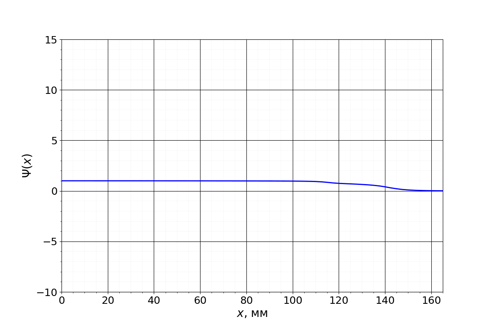

# Лабораторная работа №10
## Поиск собственных чисел и функций уравнения голосового тракта как резонатора  

#### В работе решается задача Штурма-Лиувилля:
$$
	\begin{cases}
		(S(x)\Psi'_x(x))'_x + \lambda^2 S(x)\Psi(x) = 0, &emsp;&emsp;&emsp;&emsp; 0 < x < L, \\
		\Psi'_x(0) = 0, \\
		8\sqrt{S(L)}\Psi'_x(L) + 3\pi\sqrt{\pi}\Psi(L) = 0.
	\end{cases}
$$

#### Это задание **XI.9.19** второй части сборника Аристовой и Лобанова.

#### Для решения был использован метод стрельбы.

#### Подробнее — в отчете.

    

